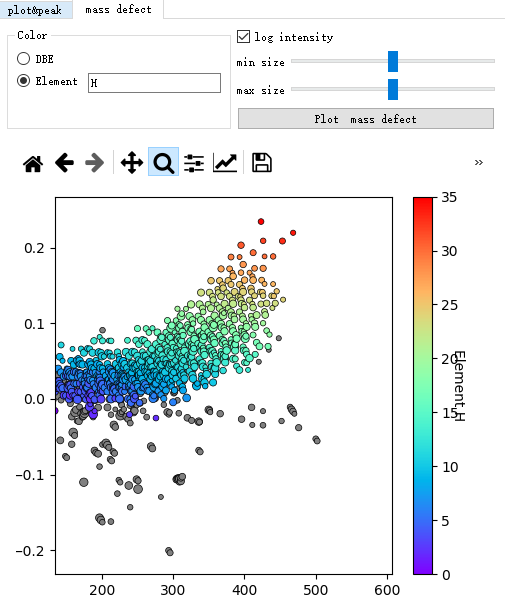

# DOCS

**⚠️Please view [our new docs in Notion](https://orbitool.notion.site/02229a2f509d4383bd38b5d2aeb0595b)⚠️**.

We are gradually moving the documentation to Notion.

# UI

Underlined character is a shortcut with Alt. Like 'Alt + A', 'Alt + B', etc.

Arrow keys is useful in peak fit tab. Up and down keys could change y axis, and left and right keys could change x axis.

## I. Tabs

### 1.Files

+ Import

  Import RAW file directly or from a folder.

+ Average

  + Use time period
  + Use num period
  + Determine time range for period

> push those buttons won't do any calculation.
>
> Shortcuts: Del for remove selected files

### 2.Noise

+ Calculate

  You can add some independent point for fit separately.

+ Denoise

> The 'denoise' button will read all files and save denoise information. (The real denoise will be done after calibration because of files' difference)
>
> Shortcuts: double click 'type' column will scale to that noise.

### 3.Peak Shape

Orbitool will use some peaks to calculate the width of peak. (if use norm distribution)

> Shortcuts: use mouse plot a red line to remove peaks

### 4.Calibration

Orbitool will use provided ions calibrate files. Different files will use different infos because of different files really need to calibrate separately.

### 5.Peak Fit

+ Filter

  Orbitool will show fitted peaks in peak list docker. You can filter use peaks filter, and filters will overlay.

+ Actions

  Actions will done for all shown peaks in peak list docker.
  
+ Plot

  Position of plot will bind with the peak list. (Can unbind with checking box)

> Shortcuts: Arrow keys for plot.

### 6.Mass Defect

...

### 7.Timeseries

+ Add a timeseries by

  + mz &  tolerance(ppm)

  + a formula

  + mz range

    will use max intensity in mz range as a timeseries

+ Add many timeseries by

  + peak list
  + mass list selected peaks
  + mass list all peaks

Export Time series

| isotime | igor time | matlab time | excel time | C3H3O3- | C2HO4- | ... |
| ------- | --------- | ----------- | ---------- | ------- | ------ | --- |
| time1   | ...       | ...         | ...        | ...     | ...    | ... |
| time2   | ...       | ...         | ...        | ...     | ...    | ... |
| ...     | ...       | ...         | ...        | ...     | ...    | ... |

### 8.Concatenate time series

You can add time series by importing csv files.

To recognize csv file's format, your csv file should be like:

| time  | formula1 | formula2 | ... |
| ----- | -------- | -------- | --- |
| time1 | ...      | ...      | ... |
| time2 | ...      | ...      | ... |
| ...   | ...      | ...      | ... |

You can change some key row/column's position to fit your csv file

+ Ion row ( formula row )
+ time column
+ ion ( formula) beginning column

## II. Dockers

Docker could be dragged out or be stacked.

  

### 1.Formula

There are only one formula calculator now. I will explain in detail below how it works and how to use it.

### 2.Mass List

Orbitool use mass list to fit peak or calculate timeseries.

+ Chemical group

  You can plus or minus a chemical group to a whole list

Import/Export

| mz  | formulas |
| --- | -------- |
| mz1 | formula1 |
| mz2 | formula2 |
| ... | ...      |

> If a mass list item has a formula, its mz doesn't matter.

### 3.Spectra List

### 4.Spectrum

### 5.Peak List

Double click at peaks could refit this peak. Input a mass could jump to the nearest peak.

## III. Toolbar

you can export workspace and config used in this tool.

### Workspace

Almost all data. File format is HDF5 file. When processing large files, please save it to disk first or will consume 

#### Input&Output

It could be exported as *.Orbitool file, when you import it, all the widgets related will be set.

### Option

Option includes

+ all states of the check box, spin box, text box and radio box.
+ formula settings, like elements' minimum and maximum and charge, ppm.
+ the ions used in calibration stage
+ mass list

#### Input&Output

It could be exported as *.Orbitool Workspace file. Means you can only import config from another workspace file.

# Details

## 1.Noise

### Global noise

use modified binPMF:

  1. make a set, called `noise set`, contains all peaks in [x.5~x.8]

  2. delete peaks bigger than $mean+N\_sigma*std$ of the `noise set`

  3. use $quantile value+N\_sigma*std$  of `noise set` as LOD line

     ps: I tested out that when quantile = 0.7, quantile value is close to mean

  4. delete peaks below LOD in original spectrum to get denoised spectrum

### Noise points

There are some points with larger noise, like NO3- and HN2O6-, etc. They should be calculated independently.

## 2.Peak Shape

...

## 3.Calibration

When averaging spectra between files, make sure calibration first.

## 4.Spectra&Peak fit

### Tag

+ A peak could be assigned with a Tag
+ Available tags are
  + Noise: this peak is a noise peak
  + Done: this peak is handled
  + Fail: this peak is failed to fit, Orbitool will automatically add this tag to peak when fail to fit peak.

## 5.Mass defect

you can choose what rainbow stand for, DBE or certain element's num. And you can choose whether use size( aka area) stand for log intensity or intensity.

## 6.Time series

...

## 7.Formula

this part is for formula guessing when fitting peaks in 'Spectra&Peak fit' tab using 'default' button.

### Formula Format

#### Input

some examples to indicate what format of formula could be understand by Orbitool

+ H2O
+ HH\[2\]O
+ NO3-
+ NH4+
+ SO4-2 or SO4e-2
+ Ca+2
+ C6(H2O)6
+ na2 s2 o 3

#### Output

some examples to help you understand the format of formula of Orbitool

+ H2O
+ HH\[2\]O
+ NO3-
+ NH4+
+ SO4-2 (Won't use SO4e-2 because of Ne-3)

### Settings

You can change the formula's settings used in formula guessing.

+ charge
+ mz range (not used now, this option is only a limit when fitting spectra.)
+ DBE
+ ppm
+ whether enable Nitrogen rule
+ whether enable DBE range & OH limit
+ elements and isotopes to be used
+ elements' parameters

### Calculator

You can input **formula** or **mass**. 

+ If formula was inputted, the result will be its mass (with electron). 
+ if mass was inputted, the Calculator will calculate and show formula(s).

### Isotope num limit

For the limit on the number of elements, the limit is "number of element atoms + number of isotope atoms + global limit".

- Element number limit: The range of the total number of all atoms of the element.
- Isotope number limit: A limit on the number range of atoms of a particular isotope, like C[12], C[13], H[1], H[3], etc. 
- Global limit: In the calculation, the sum of isotopes marked with "global limit" will not exceed this value. You can use it as a way to limit rare isotopes. However, if you have a large number of rare isotopes in your experiment, be sure not to check the "global limit" restriction for that element.

### Element info & Calculation method

Each element (take electron as a special element) has 5 parameters can be changed (some elements' some parameters won't be changed):

+ 2*DBE: 2 times element's effect to DBE
+ H min, H max: ability to replace H
+ O min, O max: ability to replace O

 I will show you with this tool's built-in elements' parameters:

|     | min | max | 2*DBE | H min | H max | O min | O max |
| --- | --- | --- | ----- | ----- | ----- | ----- | ----- |
| e   | -1  | 1   | -1    | -1    | -1    | 0     | 0     |
| C   | 0   | 20  | 2     | 0     | 2     | 0     | 3     |
| H   | 0   | 40  | -1    | -1    | -1    | 0     | 0     |
| O   | 0   | 15  | 0     | 0     | 0     | -1    | -1    |
| N   | 0   | 4   | 1     | -1    | 1     | 0     | 3     |
| S   | 0   | 3   | 0     | 0     | 0     | 0     | 4     |
| Li  | 0   | 3   | -1    | 0     | 0     | 0     | 0     |
| Na  | 0   | 3   | -1    | 0     | 0     | 0     | 0     |
| K   | 0   | 3   | -1    | 0     | 0     | 0     | 0     |
| F   | 0   | 15  | -1    | -1    | 0     | 0     | 0     |
| Cl  | 0   | 3   | -1    | -1    | 0     | 0     | 3     |
| Br  | 0   | 3   | -1    | -1    | 0     | 0     | 3     |
| I   | 0   | 3   | -1    | -1    | 0     | 0     | 3     |
| P   | 0   | 4   | 1     | -1    | 1     | 0     | 6     |
| Si  | 0   | 5   | 2     | 0     | 2     | 0     | 3     |

some parameters have some initial value:

| 2*DBE | H min | H max | O min | O max |
| ----- | ----- | ----- | ----- | ----- |
| 2     | 2     | 2     | 0     | 0     |

#### example

If I have a part of formula 'C10N-', for this part: 

+ minimum of O will be $max(0_{O:min},0_{initial:Omin}+1*0_{e:Omin}+10*0_{C:Omin}+1*0_{N:Omin})=0$
+ maximum of O will be $min(15_{O:max},0_{initial:Omax}+1*0_{e:Omin}+10*3_{C:Omax}+1*3_{N:Omax})=15$

Then program will iterate O number from 0 to 15.

If O number is 11 at some time while iterating, the part becomes 'C10O11N-':

+ minimum of H will be $max(0_{H:min},1*(-1)_{e:Hmin}+8_{\text{Hmin for C=10}}+1*(-1)_{N:Hmin})=6$
+ maximum of H will be $min(40_{H:min},2_{initial:Hmax}+1*(-1)_{e:Hmax}+10*2_{C:Hmax}+1*1_{N:Hmax})=23$

So the program will iterate H number from 6 to 23 for a specific mass guessing.

I will add some mass constrains within iteration.

for a ion 'C10H15O11N-', $DBE=\frac{2_{initial:2DBE}+1*(-1)_{e:2DBE}+10*2_{C:2DBE}+1*1_{N:2DBE}+15*(-1)_{H:2DBE}}{2}=3.5$

# Maintain

## Maintainer

The program is developed and maintained by students of Shanghai Jiao Tong University. Runlong acts as a chemical advisor during program development.

+ Developer: Yihao Li<liyihao321@sjtu.edu.cn, liyihc@outlook.com>
+ Chemical advisor: Runlong Cai<>

## Contributors

+ State Environmental Protection Key Laboratory of Formation and Prevention of Urban Air Pollution Complex, Shanghai Academy of Environmental Sciences, Shanghai, 200233, China
+ Univ. Lyon, Université Claude Bernard Lyon 1, CNRS, IRCELYON, F-69626, Villeurbanne, France.
+ Institute for Atmospheric and Earth System Research / Physics, Faculty of Science, University of Helsinki, Helsinki, 00140, Finland.

## Bugs report & function require

If you meet any bugs, please let me know. You can send me the 'log.txt' file which is under the same directory with 'Orbitool.exe'.

mail to: "Matthieu Riva"\<<matthieu.riva@ircelyon.univ-lyon1.fr>\>;  "Cheng Huang"\<<huangc@saes.sh.cn>\>

## Update logs

**⚠️Please view [our update logs in Notion](https://orbitool.notion.site/a73b2dbb579e4427a64d2bc742eec8e8)⚠️**.