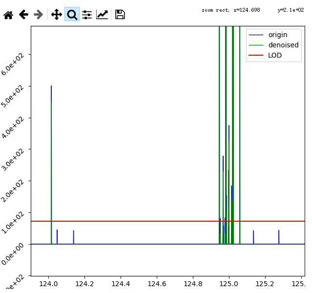
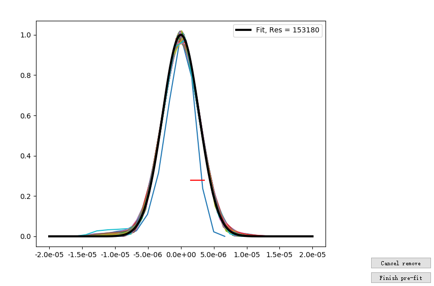
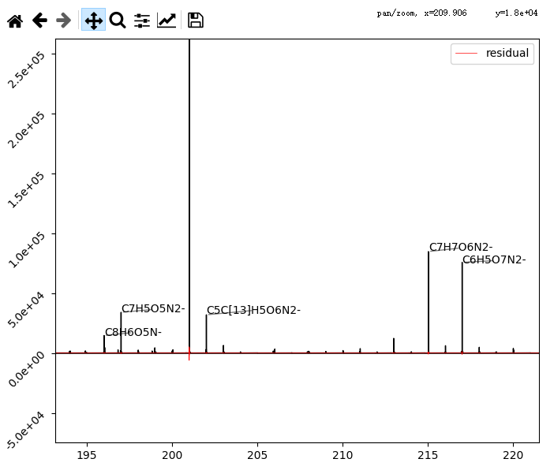
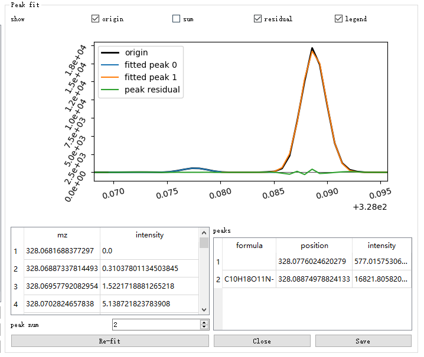

# Orbitool Readme

[TOC]

This tool can help you process with spectrum averaging, denoising, calibrating, peak fitting and generating time series.

There are 3 parts: Toolbar, Tabs, Formula/Masslist.

If you have no idea about this. Just open 'Orbitool.exe' and follow those steps

1. add a single file -> 
2. 'Average selected file' button ->
3. double click at a spectra list item->
4. 'Continue without denoising' button->
5. double click at spectra list->
6. 'Show selected's num-th highest peak' button->
7. add several ions->
8. 'Calc calibrate info' button->
9. 'Calibrate ALL SPECTRA use info and continue' button->
10. 'default' button->
11. have fun

## UI

you can change some panels' width with mouse:

+ Spectra List
+ tab 'Formula' and tab 'Mass list'
+ panels in tab 'Spectra'
+ panels in tab 'Calibration'
+ panels in tab 'Spectra&Peak fit'

## Toolbar

you can export workspace and option used in this tool.

### Workspace

Workspace includes

+ Option
+ Mass List
+ Files used
+ Spectra (excepted raw data)
+ Peak list
+ Time series

#### Input&Output

It could be exported as *.OrbitWork file, when you import it, all the widgets related will be set.

### Option

Option includes

+ all states of the check box, spin box, text box and radio box.
+ formula settings, like elements' minimum and maximum and charge, ppm.
+ the ions used in calibration stage

#### Input&Output

It could be exported as *.OrbitOption file.

## Formula/Mass list

### Formula

this part is for formula guessing when fitting peaks in 'Spectra&Peak fit' tab using 'default' button.

#### Settings

You can change the formula's settings used in formula guessing.

+ Charge
+ mz range
+ DBE
+ ppm
+ whether use Nitrogen rule
+ elements and isotopes to be used
+ elements' parameters

#### Calculator

You can input **formula** or **mass**. 

+ If formula was inputted, the result will be its mass (with electron). 
+ if mass was inputted, the Calculator will calculate and show formula(s).

Just a hint: the result text box is editable just for copying. Orbitool won't read anything from it.

#### Calculation method

each element (take electron as a special element) has 7 parameters can be changed (some elements' some parameters won't be changed):

+ MIN: minimum of the element's number
+ MAX: maximum of the element's number
+ 2*DBE: 2 times element's effect to DBE
+ H min, H max: ability to replace H
+ O min, O max: ability to replace O

 I will show you with this tool's built-in elements' parameters:

|      | min  | max  | 2*DBE | H min | H max | O min | O max |
| ---- | ---- | ---- | ----- | ----- | ----- | ----- | ----- |
| e    | -1   | 1    | -1    | -0.5  | -0.5  | 0     | 0     |
| C    | 0    | 20   | 2     | -     | 2     | 0     | 3     |
| H    | 0    | 40   | -1    | -1    | -1    | 0     | 0     |
| O    | 0    | 15   | 0     | 0     | 0     | -1    | -1    |
| N    | 0    | 4    | 1     | -1    | 1     | 0     | 3     |
| S    | 0    | 3    | 0     | 0     | 0     | 0     | 4     |
| Li   | 0    | 3    | -1    | 0     | 0     | 0     | 0     |
| Na   | 0    | 3    | -1    | 0     | 0     | 0     | 0     |
| K    | 0    | 3    | -1    | 0     | 0     | 0     | 0     |
| F    | 0    | 15   | -1    | -1    | 0     | 0     | 0     |
| Cl   | 0    | 3    | -1    | -1    | 0     | 0     | 3     |
| Br   | 0    | 3    | -1    | -1    | 0     | 0     | 3     |
| I    | 0    | 3    | -1    | -1    | 0     | 0     | 3     |
| P    | 0    | 4    | 1     | -1    | 1     | 0     | 6     |
| Si   | 0    | 5    | 2     | 0     | 2     | 0     | 3     |

for element C, H min change with number

| C num | 0    | 1    | 2    | 3    | 4    | 5    | 6    | 7    | 8    | 9    | 10   | 11   | 12   |
| ----- | ---- | ---- | ---- | ---- | ---- | ---- | ---- | ---- | ---- | ---- | ---- | ---- | ---- |
| H min | 0    | 4    | 4    | 6    | 6    | 6    | 6    | 8    | 8    | 8    | 8    | 10   | ...  |

some parameters have some initial value:

| 2*DBE | H min | H max | O min | O max |
| ----- | ----- | ----- | ----- | ----- |
| 2     | -0.5  | 2.5   | 0     | 0     |

##### example

If I have a part of formula 'C10N-', for this part: 

+ minimum of O will be $max(0_{O:min},0_{initial:Omin}+1*0_{e:Omin}+10*0_{C:Omin}+1*0_{N:Omin})=0$
+ maximum of O will be $min(15_{O:max},0_{initial:Omax}+1*0_{e:Omin}+10*3_{C:Omax}+1*3_{N:Omax})=15$

Then program will iterate O number from 0 to 15.

If O number is 11 at some time while iterating, the part becomes 'C10O11N-':

+ minimum of H will be $max(0_{H:min},-0.5_{initial:Hmin}+1*(-0.5)_{e:Hmin}+8_{\text{Hmin for C=10}}+1*(-1)_{N:Hmin})=6$
+ maximum of H will be $min(40_{H:min},2.5_{initial:Hmax}+1*(-0.5)_{e:Hmax}+10*2_{C:Hmax}+1*1_{N:Hmax})=23$

So the program will iterate H number from 6 to 23 for a specific mass guessing.

I will add some mass constrains within iteration.

for a ion 'C10H15O11N-', $DBE=\frac{2_{initial:2DBE}+1*(-1)_{e:2DBE}+10*2_{C:2DBE}+1*1_{N:2DBE}+15*(-1)_{H:2DBE}}{2}=3.5$

### Mass list

this part is for fitting peaks in 'Spectra&Peak fit' tab using 'mass list' button, or for calculating time series in 'Time series' tab.

#### ppm

2 peaks within setted ppm added to mass list will be merged into 1 single peak.

eg. 100.00 and 100.0001 added to mass list with 1ppm will be a peak 100.00005

#### Add

you can add an item to mass list like those:

+ input formula or mass in text box and push 'Add' button in mass list box. If you input a formula, the mz field and formula field will be filled. If a mass was inputted, only the mz field will be filled.

+ In 'Spectra&Peak fit' tab, select some peaks and push 'Add selected peak(s) to mass list', or just push 'Add all peaks to mass list'.

  If a peak have only one formula, the mz added to mass list will be its theoretical value.

#### Remove peaks

#### Input&Output

##### OrbitMassList file

*.OrbitMassList

##### csv file

Two columns

format:

| formula           | mz           |
| ----------------- | ------------ |
| formula1 or empty | mz1 or empty |
| formula2 or empty | mz2 or empty |
| ...               | ...          |

example:

| formula    | mz        |
| ---------- | --------- |
|            | 199.09763 |
| C6H5O8N2-  | 233.00514 |
| C4H8O12N3- |           |

When import mass list from csv file, you can choose formula or mz (If you provide both, Orbitool will insert formula instead of mz into mass list).

When export mass list to csv file, Orbitool will fill mz column and formula for peak who has formula.

#### Merge

similar to 'Import', but don't delete original mass list.

eg. your mass list has 3 peaks a, b, c. And a OrbitMassList file or csv file contains a mass list including peaks a, b, d, e. You can use merge to make your mass list become peaks a, b, c, d, e

## Tabs

### Files

------

#### Add file

'recurrence ' check box is used when open a folder. If it's checked, I will go through every files under selected folder.

#### Average

You can determine whether use number or time to average and the time range when averaging. Whenever a file as added, the time range will be recalculated.

You can simply show file without averaging or averaging all files.

Hint: push those buttons won't do any calculation.

### Spectra

------

#### tables

+ Spectra

  all spectra will be shown here. Spectrum will be shown right if double click at a spectrum.

+ Spectrum's property

  preserved

+ Spectrum

  mz-intensity

#### Background

use modified binPMF:

  1. make a set, called `noise set`, contains all peaks in [x.5~x.8]

  2. delete peaks bigger than $mean+3*std$ of the `noise set`

  3. use $quantile value+3*std$  of `noise set` as LOD line

     ps: I tested out that when quantile = 0.7, quantile value is close to mean

  4. delete peaks below LOD in original spectrum to get denoised spectrum

Denoised spectrum will be shown as green while original spectrum will be shown as blue. You can choose to remove peaks below LOD, or all peaks minus LOD, or don't do denoise.

##### Export noise

as csv file with header = "mz intensity", contains all peaks in `noise set` after step 2.

#### Calculation

If push 'Denoising for every spectrum' or 'Continue without denoising', calculation will begin to do averaging and denoising.

#### Export spectrum

as csv file with header = "mz intensity"

#### Figure

If 'Scroll according to plot' check box is checked, the spectrum table will scroll to the left mz of the figure.

##### y log scale

I will autoscale y axis after toggling

##### autoscale y axis

rescale the figure to fit the highest peak and x axis within current x range

### Pre peak fitting

------

all spectra are shown in left table. Select how much peak used in peak fitting and show.

#### Remove unique peak

Push your left mouse button and scroll, a red line will appear like below figure. When you release button, all peak crossed will be removed. If you delete caches, may take seconds initializing.

#### Cancel remove

canceled peak's color often is different with color before removing

### Calibration

-----

#### Tables

+ Ions

  There are ions used for mass calibration, added by typing ions to text box. Multi ions could be add by split by comma as "HNO3NO3-,C6H3O2NNO3-,C6H5O3NNO3-"

+ Information

  ions' formula and files' ppm will be shown

#### Calibrate step

1. Add ions
2. click 'Calc calibrate info' to get calibration information
3. click 'Calibrate ALL SPECTRA use info and continue'  to finish calibration and begin calculation

#### Show single file's information

by pushing "Show selected file's info", you will get a figure show a file's calibration curve. The x axis will be mz range you set in tab 'Formula'.

### Spectra&Peak fit

---

If you want to see a spectrum's peaks, select a spectrum and push 'default'. This tool will calculate formulas for each peaks and show them in peak list table.

This figure will automatically show 5 highest peaks' formula whose peak point is in window. If one of the 5 highest peak have no formula, formula will belong to the sixth one, etc.

If you want to refit a peak, could double click a peak in peak list. You can change 'peak num' and push 'Re-fit' button. If you click 'Save' button, the change will be added to peak list, and the peaks' formulas won't be changed unless you refit the spectrum again. You can change formula in 'Peak fit' box by double clicking that cell.

> you can change 2 things in this groupbox: peak num, formulas
>
> Because sometimes Orbitool can't fit noise peaks, Orbitool will print those to error.txt silently.

#### Mass defect

you can choose what rainbow stand for, DBE or certain element's num. And you can choose whether use size( aka area) stand for log intensity or intensity.

### Time series

you can add time series by following methods:

+ mz with ppm
+ formula with ppm
+ mz range (eg. 100.001-100.002)
+ selected peaks in 'Spectra&Peak fit' tab's peak list with ppm
+ (selected) peaks in mass list with ppm

Time series will be shown right. If you want to check a specific time series, double it in the table, or export all time series.

### Concatenate time series

You can add time series by importing csv files.

To recognize csv file's format, your csv file should be like:

| time  | formula1 | formula2 | ...  |
| ----- | -------- | -------- | ---- |
| time1 | ...      | ...      | ...  |
| time2 | ...      | ...      | ...  |
| ...   | ...      | ...      | ...  |

You can change some key row/column's position to fit your csv file

+ Ion row ( formula row )
+ time column
+ ion ( formula) beginning column

### Bugs

If you meet any bugs, please let me know. You can send me the 'error.txt' file which is under the same directory with 'Orbitool.exe'.

## Maintainer
+ School of Electronic, Information and Electrical Engineering, Shanghai Jiao Tong University, Shanghai, 200240, China

## Contributors

+ State Environmental Protection Key Laboratory of Formation and Prevention of Urban Air Pollution Complex, Shanghai Academy of Environmental Sciences, Shanghai, 200233, China
+ Univ. Lyon, Université Claude Bernard Lyon 1, CNRS, IRCELYON, F-69626, Villeurbanne, France.
+ Institute for Atmospheric and Earth System Research / Physics, Faculty of Science, University of Helsinki, Helsinki, 00140, Finland.

## Bugs report & function require

mail to: huangc@saes.sh.cn

cc: yiping@sjtu.edu.cn

## log

**2020.7.29 version 1.3.3**

Appended

+ could skip calibration

Bug fix

+ error when spectra merge peaks
+ multiple same peaks in mass list

**2020.7.24 version 1.3.2**

Bug fix

+ error when delete ions in calibration tab
+ change policy for peak failed to fit 

**2020.7.10 version 1.3.1**

Appended

+ export spectra

Bug fix

+ error occured when averaging RAW file with multiple filters

**2020.6.26 version 1.3.0**

Appended

+ concatenate time series (beta)
+ add some formula function for future
+ time series's header in table will indicate line in plot. To achieve this, change UI's style

Changed

+ substitute numba with cython

Bug fix

+ caption wrong when read workspace file
+ move colorbar's label to top in mass defect tab

**2020.6.21 version 1.2.9**

Change

+ when export mass list, use 2 columns (formula,mz) instead of 1 mixed column

Bug fix
+ some "index out of range"

**2020.5.22 version 1.2.8**

Change

+ when calculate mass defect, use nearest formula instead of treat it as a grey point for a peak with multi-formula.

Bug fix
+ when add peaks to mass list, there will be some peak not merged.
+ error when calculate mass defect using element.

**2020.5.15 version 1.2.7**

Appended
+ Export
  + fit infomation
  + mass defect
+ when export time serieses
  + export time as isotime, igor time, matlab datenum, excel datenum
  + choose with or without text "with ppm"

Bug fix
+ numba.numpy_extensions not found. numba changed its interface in new version, and new version have some errors when generate executable files, so use numba's version 0.48
+ wrong spelling
  from "Oribit" to "Orbit"

**2020.4.17 version 1.2.6**

Appended
+ Merge close peaks

Bug fix
+ area calculation

**2020.4.9 version 1.2.5**

Bug fix
+ Crash when type wrong element

**2020.3.31 version 1.2.4**

Bug fix
+ Error when merge mass list

**2020.3.31 version 1.2.3**

Bug fix
+ scan number error while averaging (maybe fix or not, I have no file to test)
+ math domain error when fit peak, and this is a reason for 'NoneType' object has no attribute 'fileTime' error. But this peak must be wrong, because this error only occurs when mz less than 0.
+ convert inputted formula with isotopes wrong.

**2020.03.31 version 1.2.2**

Bug fix
+ Division Zero Error when autoscale timeseries
+ Error when average by number

Changed
+ Rewrite average by time part

**2020.03.30 version 1.2.1**

Bug fix
+ Error when merge peaks in mass list
+ Erroe when fit use mass list
+ Error when add isotope

Maybe fixed
+ Error scan number

**2020.03.29 version 1.2.0**

Bug fix
+ Out of range when remove peak from mass list

Appended
+ Log scale and autoscale in timeseries
+ Merge mass list
+ Mass defect

Changed
+ When averaging across file, keep time interval 

**2020.03.17 version 1.1.2**

Bug fix
+ Error when use mass list fit spectrum

**2020.03.12 version 1.1.1**

Bug fix
+ Cannot show file's calibration information

**2020.03.11 version 1.1.0**

Warning

+ I rewrite formula calculation part by cython, so it mismatch with former OrbitWork/OrbitOption file

Appended

+ Rewrite formula calculation part by cython which is extremely fast than python (50 times faster without accuracy loss, the only cost is nearly 2 weeks coding). I also changed the structure, now you can add any element you want
+ Formula panel size changeable

**2020.02.29 version 1.0.3**

Warning

+ I add a polarity filter, so it mismatch with former OrbitWork file

Appended

+ polarity filter when averaging spectrum

Change

+ UI

**2020.02.27 version 1.0.2**

Warning

+ I change the structure of .OrbitWork file, so it may mismatch with former .OrbitWork file.

Appended

+ resize panels by mouse(test)
+ option for whether y axis use log scale
+ autoscale button for spectra
+ ppm column in 'Spectra&Peak fit' tab
+ isotope ratio column in 'Peak fit' group box

**2020.02.15  version 1.0.1**

Bug fix

+ ppm when show single file's calibration information
+ wrong elements shown in formula. eg. Na when negative and S when positive
  rewrite formula interface logic
+ "'NoneType' object has no attribute 'addPeaks'" when add peak to mass list without initialize in 'Spectra&Peak fit'
  

Appended

+ It's possible to show multi files' spectra without averaging
+ Mass list: Export to or import from csv file

Change

+ show multi ions in a time when show time series

**2020.02.12 version 1.0.0**

  have functions:

+ Option( include formula) input/output
+ Mass list input/output
+ Formula guess and calculate
+ background
  + calculate
  + recalculate
  + quantile
+ peak fit
+ mass calibratiom
+ time series

